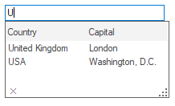
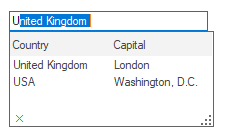
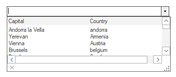

# Winforms-AutoComplete-Examples
The WinForms Autocomplete component allows users to enable autocompletion functionality for any edit control. Multiple columns with a header in the autocomplete pop-up provide information for each matching entry. Its rich, built-in feature set includes different autocompletion modes such as suggest and append, appearance customization, and more. For more details please refer [What is winforms AutoComplete](https://www.syncfusion.com/kb/1086/what-is-the-autocomplete-control).

## AutoComplete Modes
* Suggest: Displays suggestion in drop-down list.

* Append: Appends the first suggestion to text.

* SuggestAppend: Performs both the above ways.

## DataSource
Sets the Datasource to the Autocomplete component. The AutoComplete component automatically picks the "History Data List" mode or "Data source" mode based on the values set for the DataSource property. When the datasource property is set to NULL (default value is NULL), the component defaults to History Data List mode. It is to be remembered that the properties CategoryName, AutoAddItem, and AutoSerialize have to be set appropriately for the History Data List mode to work properly.

## Override Combo
If MS ComboBox is used as editor control, the Combobox dropdown can be suppressed and overridden by the AutoComplete component using the OverrideCombo property.

## Persistence
The history list of AutoComplete component can be saved in the following formats:

* Binary Format
* XML Format
* IsolatedStorage medium
* MemoryStream
* PersistState property

The AutoComplete component has a fully built-in serialization feature that provides automatic serialization for the AutoComplete’s history list. The serialization mechanism is implemented using the standardized Syncfusion.Windows.Forms.AppStateSerializer component that acts as a central coordinator for all the Essential tools components and provides options to read or write to different media such as the default isolated storage, XML file, XML stream, binary file, binary stream, and the Windows Registry.
 
# Integration with RichTextBox control

The auto-complete functionality can be added to the RichTextBox control. The following steps are used to integrate the RichTextBox with the AutoComplete component:

1. Implement the `IEditControlsEmbed` interface in a CustomRichTextBox class that enables the AutoComplete functionality for the RichTextBox control.

## C#

    public class CustomRichTextBox : System.Windows.Forms.RichTextBox, IEditControlsEmbed

     {
           // Returns the active RichTextBox control.
            public Control GetActiveEditControl(IEditControlsEmbedListener listener)
            {
                       return (Control)this;
            }
     }

2. Create an instance for the CustomRichTextBox class and the AutoComplete component. Then, use the [SetAutoComplete](https://help.syncfusion.com/cr/windowsforms/Syncfusion.Windows.Forms.Tools.AutoComplete.html#Syncfusion_Windows_Forms_Tools_AutoComplete_SetAutoComplete_System_Windows_Forms_Control_Syncfusion_Windows_Forms_Tools_AutoCompleteModes_) method of AutoComplete component to enable auto-complete support for the RichTextBox control.

## C#

    Syncfusion.Windows.Forms.Tools.AutoComplete autoComplete1= new Syncfusion.Windows.Forms.Tools.AutoComplete();
    CustomRichTextBox richTextBox1= new CustomRichTextBox();    
    autoComplete1.SetAutoComplete(richTextBox1, Syncfusion.Windows.Forms.Tools.AutoCompleteModes.AutoSuggest);

