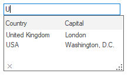
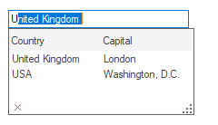
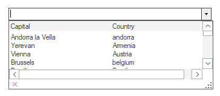
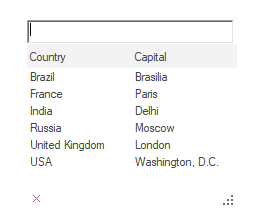

# Winforms-AutoComplete-Examples
## Overview
The WinForms AutoComplete component allows users to enable autocomplete functionality to edit controls. It supports multi-column suggestions with headers, multiple modes (Suggest, Append, SuggestAppend), and rich appearance customization. See What is WinForms AutoComplete for details: https://www.syncfusion.com/kb/1086/what-is-the-autocomplete-control

## AutoComplete Modes
* Suggest: Shows suggestions in a drop-down list.
  

* Append: Appends the best match to the typed text.
  

* SuggestAppend: Combines Suggest and Append.
  


## DataSource for AutoComplete
Datasource for AutoComplete operates in one of two ways, chosen by the DataSource property:
- History Data List mode: When DataSource is null (default), the control records and uses user-entered items. Set CategoryName, AutoAddItem, and AutoSerialize appropriately for this mode.
- Data source mode: When DataSource is set, items come from your bound list.

## Override Combo
When using a standard Windows Forms ComboBox as the editor, you can suppress the ComboBox’s own drop-down and use AutoComplete’s suggestion UI via the OverrideCombo property.



## Persistence
The AutoComplete history list can be persisted in the following formats:

- Binary file/stream
- XML file/stream
- Isolated storage
- Windows Registry

You control this via the PersistState property and AppStateSerializer settings. Note: The serializer type is Syncfusion.Windows.Forms.AppStateSerializer.

## Integration with RichTextBox control
You can enable AutoComplete on a RichTextBox by implementing IEditControlsEmbed and calling SetAutoComplete.

Step 1: Implement `IEditControlsEmbed` 
```C#
    using System.Windows.Forms;
    using Syncfusion.Windows.Forms.Tools;

    public class CustomRichTextBox : RichTextBox, IEditControlsEmbed
    {
           // Returns the active RichTextBox control.
            public Control GetActiveEditControl(IEditControlsEmbedListener listener)
            {
                       return (Control)this;
            }
     }
```
Step 2: Attach AutoComplete
```C#
    var autoComplete = new AutoComplete();
    var richTextBox = new CustomRichTextBox();    
    autoComplete.SetAutoComplete(richTextBox, AutoCompleteModes.AutoSuggest);
```

